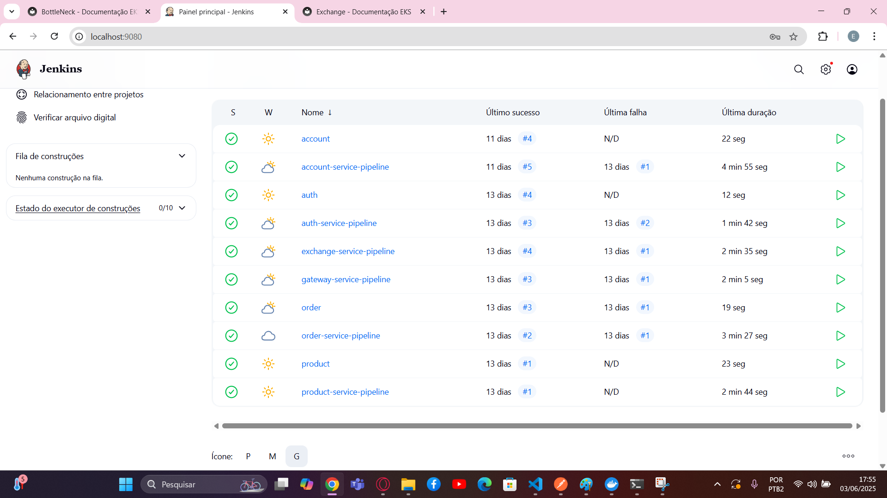

# Jenkins Pipeline

## Visão Geral

Esta etapa do projeto define a automação do **deploy de microserviços em um cluster Kubernetes** utilizando **Jenkins**. A pipeline contempla as etapas de versionamento, build, empacotamento, publicação no Docker Hub e deploy em um cluster K8s.

A automação garante consistência, reprodutibilidade e integração contínua entre os serviços da aplicação.

---

## Estrutura do Projeto

Todos os microserviços devem conter um `Jenkinsfile` em seu respectivo diretório:

```
.
├── account-service
│   ├── Jenkinsfile
│   └── ...
├── auth-service
│   ├── Jenkinsfile
│   └── ...
├── gateway-service
│   ├── Jenkinsfile
│   └── ...
├── product-service
│   ├── Jenkinsfile
│   └── ...
├── order-service
│   ├── Jenkinsfile
│   └── ...
```

O pipeline principal deve estar na **raiz do projeto**, orquestrando o deploy de todos os microserviços no mesmo cluster Kubernetes.

---

## Etapas do Pipeline

### Etapas obrigatórias:

1. **SCM (Source Code Management)** – Obtém o código mais recente do repositório.
2. **Dependencies** – Garante que dependências do microserviço estejam resolvidas.
3. **Build** – Empacota o serviço (ex: com Maven).
4. **Push to Docker Hub** – Cria e envia a imagem para o Docker Hub.
5. **Deploy to K8s** – Realiza o deploy da imagem no cluster Kubernetes.

---

## Exemplo de Jenkinsfile – `account-service`

```groovy
pipeline {
    agent any
    environment {
        SERVICE = 'account'
        NAME = "humbertosandmann/${env.SERVICE}"
    }
    stages {
        stage('Dependecies') {
            steps {
                build job: 'account', wait: true
            }
        }
        stage('Build') { 
            steps {
                sh 'mvn -B -DskipTests clean package'
            }
        }      
        stage('Build & Push Image') {
            steps {
                withCredentials([usernamePassword(credentialsId: 'dockerhub-credential', usernameVariable: 'USERNAME', passwordVariable: 'TOKEN')]) {
                    sh "docker login -u $USERNAME -p $TOKEN"
                    sh "docker buildx create --use --platform=linux/arm64,linux/amd64 --node multi-platform-builder-${env.SERVICE} --name multi-platform-builder-${env.SERVICE}"
                    sh "docker buildx build --platform=linux/arm64,linux/amd64 --push --tag ${env.NAME}:latest --tag ${env.NAME}:${env.BUILD_ID} -f Dockerfile ."
                    sh "docker buildx rm --force multi-platform-builder-${env.SERVICE}"
                }
            }
        }
    }
}
```

## Jenkins



---

## Observações

- Todos os microserviços devem ser enviados para o mesmo **cluster Kubernetes**.
- O uso do `docker buildx` permite builds multiplataforma.
- As **credenciais Docker Hub** devem estar configuradas no Jenkins (`dockerhub-credential`).
- Utilize `build job: 'serviço'` para acionar builds dependentes.

---

## Requisitos

- Jenkins com plugins de Docker, Kubernetes e Git configurados.
- Credenciais seguras salvas no Jenkins.
- Acesso ao cluster K8s previamente configurado.
- Repositório Git com estrutura de microserviços.

---

## Considerações Finais

- Essa estrutura promove **CI/CD eficiente e padronizado**.
- Pode ser expandida com testes automatizados, lint, análise estática de código e integração com Prometheus/Grafana.
- Ajuda no **versionamento controlado de imagens** com o uso do `BUILD_ID`.

---
